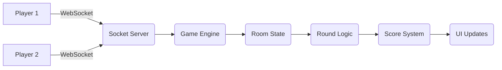

<p align="center">
  
</p>

<h2 align="center">🎮 WordQuest — Real-Time Multiplayer Word Game</h2>

<p align="center">
  <b>A Real-Time Multiplayer Word Guessing Game powered by WebSockets</b>
</p>

<p align="center">
  
  
  
  
  
  
</p>

---

## ✨ Features

- 🎮 Real-time multiplayer gameplay
- 🔗 Create & join rooms instantly
- ⏱️ Server-controlled countdown timer
- 🔤 Progressive word reveal system
- 🧠 Smart scoring mechanism
- 🏆 Leaderboard using Prisma
- 🎭 Avatar selection system
- ⚡ WebSocket-based real-time sync
- 🔄 Smooth round transitions
- 📱 Fully responsive UI

---

## 🎬 Live Demo

👉 [https://your-vercel-app.vercel.app](https://your-vercel-app.vercel.app)

---

## 🧠 Architecture



---

## ⚙️ Tech Stack

### 🖥️ Frontend
- Next.js (App Router)
- React 19
- Tailwind CSS
- Socket.IO Client

### ⚙️ Backend
- Node.js
- Socket.IO
- Custom Game Engine

### 🗄️ Database
- Prisma ORM
- SQL Database

### ☁️ Deployment
- **Vercel** → Frontend
- **Render** → Backend

---

## 📂 Project Structure

```
📦 WordQuest
├── app/                # Next.js pages
├── components/         # UI components
├── lib/                # Socket + utilities
├── server/
│   ├── services/
│   │   ├── GameService.ts
│   │   └── WordService.ts
├── prisma/             # Database schema
├── server.ts           # Backend entry
└── package.json
```

---

## ⚡ Game Flow

```
1. User enters username
2. Creates or joins a room
3. Game starts automatically when both players connect
4. Timer begins (backend controlled)
5. Letters reveal progressively each tick
6. Player submits guess within the tick window
7. Score updates in real-time
8. Next round starts after short delay
9. Winner declared after max rounds
```

---

## ⏱️ Timer System

- Implemented using `setInterval()` on the backend
- Stored in `room.tickTimer`
- Emits tick updates via WebSocket
- Stops automatically on round end
- Prevents client-side manipulation

---

## 🧠 Core Game Logic

- Backend controls entire game state
- `roundEnded` flag prevents duplicate execution
- Race conditions handled using locking mechanism
- Score updates happen only once per round
- Only one guess per player accepted per tick

---

## 🔐 Environment Variables

**Backend (`.env`)**
```env
DATABASE_URL=your_database_url
```

**Frontend (`.env.local`)**
```env
NEXT_PUBLIC_SOCKET_URL=https://your-backend.onrender.com
```

---

## 🚀 Running Locally

1. **Clone the repository**
   ```bash
   git clone https://github.com/HarshiT14110/WordQuest.git
   cd WordQuest
   ```

2. **Install dependencies**
   ```bash
   npm install
   ```

3. **Set up environment variables**
   ```bash
   cp .env.example .env
   # Fill in your values
   ```

4. **Push Prisma schema**
   ```bash
   npx prisma db push
   ```

5. **Start development server**
   ```bash
   npm run dev
   ```

6. **Open in browser**
   ```
   http://localhost:3000
   ```

---

## 🌍 Deployment

### Backend (Render)
- Node.js server with WebSocket support
- Uses environment variables for configuration
- Handles all real-time game logic

### Frontend (Vercel)
- Next.js deployment
- Connects to backend via `NEXT_PUBLIC_SOCKET_URL`

---

## 🔮 Future Improvements

- 💬 Real-time in-game chat
- 🎯 Difficulty levels
- 🧑‍🤝‍🧑 Spectator mode
- 🔁 Rematch feature
- 🌐 Global leaderboard
- 🎨 Advanced animations

---

## 🧑‍💻 Author

**Harshit Agarwal** — 🚀 Full Stack Developer

---

## ⭐ Support

If you like this project:
- ⭐ Star the repository
- 🔗 Share it with others

---

<p align="center">⚡ Built with passion & precision ⚡</p>

<p align="center">
  
</p>
